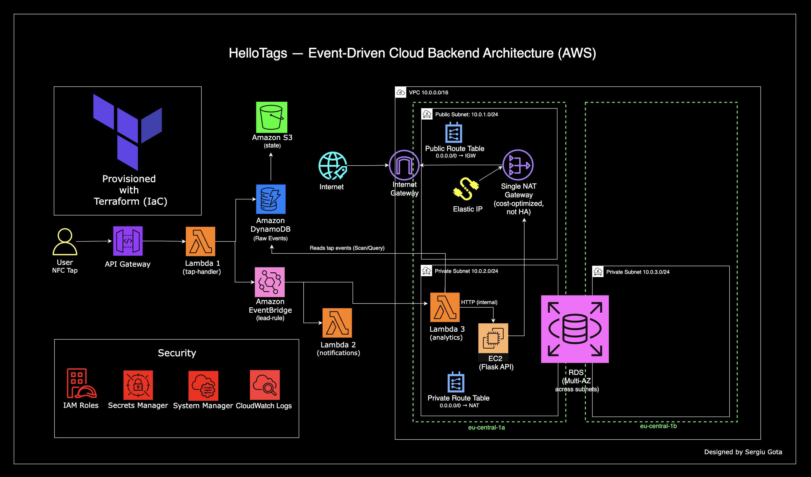

# HelloTags — Event-Driven Cloud Backend Architecture (AWS)

### API Gateway · Lambda · DynamoDB · EventBridge · EC2 · RDS PostgreSQL · Secrets Manager · Terraform · Python

[](https://aws.amazon.com/)
[](https://www.terraform.io/)
[](https://www.python.org/)
[](https://aws.amazon.com/lambda/)
[](https://aws.amazon.com/dynamodb/)
[](https://aws.amazon.com/rds/)
[](https://aws.amazon.com/eventbridge/)

---

## Overview

HelloTags is a cloud backend for NFC-powered digital business cards. When a user taps an NFC card, an HTTP POST hits the API. Within milliseconds, the tap is stored in DynamoDB, an event is fired to EventBridge, a notification handler processes it asynchronously, and the analytics handler writes structured data to a PostgreSQL RDS instance via a VPC-internal Flask API running on EC2.

The system demonstrates a production-style event-driven architecture: serverless ingestion at the edge, decoupled async processing via EventBridge, durable analytics storage in RDS, and zero public exposure of compute or database resources. All infrastructure is provisioned by Terraform and destroyed completely with a single command.

**Region:** eu-central-1 · **IaC:** Terraform with remote state on S3 + DynamoDB locking · **Access:** SSM Session Manager — no SSH, no bastion host

---

## The Problem

NFC digital business cards solve the physical card problem — but most implementations stop at the card itself. The profile page is static. There is no tap tracking, no analytics, no insight into who engaged and when. Business owners hand out cards and have no idea if they work.

HelloTags adds the backend layer that makes NFC cards intelligent:

- **Tap tracking** — every card interaction recorded in real time
- **Event-driven processing** — taps trigger downstream workflows without tight coupling
- **Analytics persistence** — structured tap data written to PostgreSQL for querying and reporting
- **Secure admin access** — EC2 administration via SSM, never SSH, never public IP

---

## Architecture



```
NFC Card Tap (HTTP POST)
        │
        ▼
API Gateway (hellotags-public-api)
    POST /tap
        │
        ▼
Lambda: tap-handler  ── Python 3.12 · VPC-attached · private subnet
        │
        ├──▶ DynamoDB (tap-events)  ── Immediate storage · card_id + timestamp key
        │
        └──▶ EventBridge (default bus)  ── Async event emission
                    │  source: hellotags.tap
                    │  DetailType: TapEvent
                    ▼
            EventBridge Rule (tap-events-rule)
                    │
          ┌─────────┴──────────┐
          ▼                    ▼
Lambda: notification-handler   Lambda: analytics-handler
(VPC · private subnet)        (VPC · private subnet)
                                    │
                                    ▼ HTTP (internal)
                              EC2: Flask API  ── Private subnet · SSM access only
                                    │
                                    ▼
                              RDS PostgreSQL  ── Private subnet · Multi-AZ capable
                              (tap_analytics table)

Infrastructure
├── VPC 10.0.0.0/16
│   ├── Public Subnet 10.0.1.0/24 (eu-central-1a)  ── IGW · NAT Gateway · Elastic IP
│   ├── Private Subnet A 10.0.2.0/24 (eu-central-1a)  ── Lambda · EC2 · private route → NAT
│   └── Private Subnet B 10.0.3.0/24 (eu-central-1b)  ── RDS (DB subnet group spans both AZs)
│
├── Security
│   ├── EC2 SG  ── No inbound rules · egress only · SSM access
│   └── RDS SG  ── Port 5432 from EC2 SG only
│
└── State Management
    ├── S3 (hellotags-terraform-state)  ── Remote state storage · encrypted
    └── DynamoDB (hellotags-terraform-locks)  ── State locking
```

---

## Services Used

| Service | Role |
|---|---|
| **Amazon API Gateway (HTTP)** | Exposes the public `POST /tap` endpoint |
| **AWS Lambda — tap-handler** | Ingests tap event, writes to DynamoDB, fires EventBridge event |
| **AWS Lambda — notification-handler** | Consumes EventBridge events, processes notifications |
| **AWS Lambda — analytics-handler** | Consumes EventBridge events, POSTs to internal EC2 Flask API |
| **Amazon DynamoDB** | Raw tap event storage — on-demand capacity, composite key (card_id + timestamp) |
| **Amazon EventBridge** | Decouples tap-handler from downstream consumers via event routing rules |
| **Amazon EC2 (Flask API)** | Internal analytics API — private subnet, SSM-managed, no public IP |
| **Amazon RDS PostgreSQL** | Persistent analytics storage — encrypted, private subnet, Multi-AZ capable |
| **AWS Secrets Manager** | RDS credentials injected at runtime — never hardcoded |
| **AWS Systems Manager** | EC2 access via Session Manager — zero SSH exposure |
| **Amazon VPC** | Network isolation — private subnets, NAT Gateway, IGW, security groups |
| **Amazon CloudWatch** | Lambda execution logs across all three functions |
| **AWS IAM** | Execution roles per function, EC2 SSM role, least-privilege policies |
| **Terraform** | Full infrastructure provisioned and destroyed as code — remote state on S3 |

---

## Processing Flow

1. An NFC card is tapped, triggering an HTTP POST to the API Gateway `/tap` endpoint with a `card_id` payload
2. API Gateway proxies the request to **tap-handler** Lambda (VPC-attached, private subnet)
3. tap-handler generates a millisecond-precision timestamp, writes the record to DynamoDB (`card_id` + `timestamp` composite key), and fires a `TapEvent` to EventBridge with the card data in the event `detail`
4. The HTTP 200 response is returned to the NFC client — storage is guaranteed before the response
5. The EventBridge rule matches on `source: hellotags.tap` and fans out to two targets simultaneously:
   - **notification-handler** — processes the tap event for downstream notification workflows
   - **analytics-handler** — POSTs the tap data to the internal Flask API via HTTP over the private subnet
6. The Flask API on EC2 receives the analytics payload and writes a record to the `tap_analytics` table in RDS PostgreSQL
7. RDS credentials are fetched at runtime from Secrets Manager — never stored in environment variables or source code
8. CloudWatch collects invocation logs and metrics from all three Lambda functions

---

## Project Structure

```
hellotags-cloud-backend/
│
├── architecture/
│   └── hellotags-architecture.png          # End-to-end architecture diagram
│
├── lambda/
│   ├── tap_handler.py                      # Ingest → DynamoDB + EventBridge
│   ├── notification_handler.py             # EventBridge consumer → notifications
│   └── analytics_handler.py               # EventBridge consumer → EC2 Flask API → RDS
│
├── terraform/
│   ├── main.tf                             # VPC, subnets, IGW, NAT, route tables
│   ├── api_gateway.tf                      # HTTP API, integration, route, stage, permission
│   ├── lambda.tf                           # All three Lambda functions
│   ├── dynamodb.tf                         # tap-events table
│   ├── eventbridge.tf                      # Event rule and targets
│   ├── ec2.tf                              # Admin EC2 instance, SSM role, instance profile
│   ├── rds.tf                              # RDS PostgreSQL, DB subnet group, Secrets Manager
│   ├── security_groups.tf                  # EC2 SG (egress only), RDS SG (5432 from EC2)
│   ├── iam.tf                              # Lambda execution roles and policy attachments
│   ├── backend.tf                          # S3 remote state + DynamoDB locking
│   └── outputs.tf                          # API Gateway endpoint URL
│
├── .gitignore
└── README.md
```

---

## Deployment

### Prerequisites

- AWS CLI configured with appropriate credentials
- Terraform >= 1.0 installed
- S3 bucket and DynamoDB table for remote state must exist before `terraform init`

### Provision

```bash
terraform init      # Initialise S3 backend + download hashicorp/aws provider
terraform plan      # Preview all resources before apply
terraform apply     # Provision full stack
```

### Test

```bash
curl -X POST https://<your-api-id>.execute-api.eu-central-1.amazonaws.com/prod/tap \
  -H "Content-Type: application/json" \
  -d '{"card_id": "card-abc-123"}'
```

Expected response:
```json
{"message": "tap recorded"}
```

Within seconds: the record appears in DynamoDB, EventBridge delivers the event to both Lambda targets, and analytics-handler writes the tap to RDS PostgreSQL via the internal Flask API.

### EC2 Admin Access (SSM)

```bash
aws ssm start-session --target <instance-id> --region eu-central-1
```

No SSH. No key pair. No public IP. No bastion. Access is entirely through AWS Systems Manager Session Manager.

### Teardown

```bash
terraform destroy   # Remove all resources · zero orphaned infrastructure
```

---

## Security Design

**No public compute exposure.** All Lambda functions, EC2, and RDS run in private subnets. No resource has a public IP or is directly reachable from the internet.

**No SSH.** EC2 is accessed exclusively via SSM Session Manager. The EC2 security group has no inbound rules — egress only.

**No hardcoded credentials.** RDS credentials are generated by Terraform (`random_password`), stored in Secrets Manager, and fetched at Lambda runtime via the AWS SDK. They never appear in source code or environment variables.

**Network isolation by security group.** RDS accepts connections on port 5432 from the EC2 security group only. Lambda functions share the EC2 security group for simplicity (production improvement: dedicated Lambda SG).

**Encrypted at rest.** RDS storage encryption enabled. Secrets Manager encrypts credentials using AWS KMS by default.

**Remote state with locking.** Terraform state is stored in S3 with server-side encryption and a DynamoDB lock table — preventing concurrent applies from corrupting state.

---

## Engineering Decisions

**Why EventBridge fan-out instead of direct Lambda invocation?**
tap-handler emits a single event. EventBridge routes it to two consumers simultaneously — notification-handler and analytics-handler — without tap-handler knowing either exists. Adding a third consumer (a CRM integration, an audit log, a real-time dashboard) requires a new EventBridge target, not a code change to tap-handler. This is the correct decoupling pattern for extensible event-driven systems.

**Why DynamoDB for raw tap events and RDS for analytics?**
DynamoDB is the right store for raw tap ingestion: write-heavy, key-value access pattern, no joins, millisecond latency, zero operational overhead, on-demand pricing. RDS PostgreSQL is the right store for analytics: structured schema, queryable by time range and card, aggregatable with SQL. Each store matches its access pattern — using one for both would be a compromise.

**Why EC2 + Flask instead of Lambda for analytics writes?**
The Flask API on EC2 represents a persistent service layer that owns the database connection pool and schema logic. This is a deliberate architectural choice to demonstrate a hybrid serverless + containerised-service pattern — Lambda handles stateless event processing, EC2 handles stateful service logic. In production this could be ECS Fargate with an ALB, but EC2 is the minimal viable equivalent for portfolio demonstration.

**Why SSM over SSH for EC2 access?**
SSH requires open port 22, a key pair, and a public IP or bastion host. SSM requires none of these — access is authenticated via IAM, logged to CloudWatch, and auditable. The security group has zero inbound rules. This is the production-standard access pattern for private EC2 instances in AWS.

**Why Secrets Manager instead of environment variables for RDS credentials?**
Environment variables in Lambda are visible in the console and included in function configuration exports. Secrets Manager stores credentials encrypted, access is controlled by IAM, and rotation can be enabled without redeploying the function. The credential fetch adds a single SDK call at cold start — an acceptable tradeoff for significantly stronger secrets hygiene.

**Why a single NAT Gateway?**
Cost optimisation. A NAT Gateway in each AZ would provide AZ-level fault tolerance for private subnet egress, but costs ~£30/month per gateway. For a development and portfolio project, a single NAT Gateway in the public subnet is the correct tradeoff. Documented explicitly — not an omission.

---

## Troubleshooting

### 1. Lambda not triggered from EventBridge

Problem:
EventBridge rule exists but Lambda not invoked

Cause:
Missing `aws_lambda_permission`

Fix:
```hcl
resource "aws_lambda_permission" "allow_eventbridge" {
  statement_id  = "AllowExecutionFromEventBridge"
  action        = "lambda:InvokeFunction"
  function_name = aws_lambda_function.analytics.function_name
  principal     = "events.amazonaws.com"
  source_arn    = aws_cloudwatch_event_rule.rule.arn
}
```

---

### 2. Lambda cannot reach EC2 (timeout)

Problem:
analytics-handler times out

Cause:
Wrong VPC / subnet / SG

Fix:
- Ensure Lambda is in same VPC
- Use **private IP (10.x.x.x)**
- Check SG allows outbound

---

### 3. RDS connection fails

Problem:
EC2 cannot connect to PostgreSQL

Cause:
Security group misconfiguration

Fix:
- RDS SG must allow **5432 from EC2 SG**
- Not from 0.0.0.0/0

---

### 4. API works but no data in DynamoDB

Problem:
200 response but table empty

Cause:
Wrong environment variable or IAM role

Fix:
- Verify `TABLE_NAME`
- Ensure role has `dynamodb:PutItem`

---

## Production Improvements

- Separate IAM roles per Lambda
- Add DLQ for EventBridge
- Secrets caching
- RDS connection pooling
- Move EC2 → ECS Fargate
- Add API authentication
- Add CI/CD pipeline

---

## Things I learned while building this

1. EventBridge decoupling is critical for scalability  
2. VPC networking is the hardest part, not Lambda  
3. Private communication requires correct routing + SG  
4. Secrets Manager is better than env vars  
5. Debugging distributed systems = logs everywhere  


## Production Improvements

- **Dedicated IAM roles per Lambda** — tap-handler needs only `dynamodb:PutItem` + `events:PutEvents`; analytics-handler needs only `secretsmanager:GetSecretValue`; currently all three share one role
- **Dead-letter queue (DLQ)** — EventBridge target failures are silently dropped; a DLQ captures failed invocations for inspection and replay
- **Secrets Manager caching** — module-level credential caching with TTL to reduce SDK calls and cold start latency
- **RDS connection pooling** — psycopg2 connections should be managed with a pool (e.g. `psycopg2.pool.SimpleConnectionPool`) to avoid reconnecting on every Lambda invocation
- **ALB + ECS Fargate for Flask API** — replaces the single EC2 instance with a managed, scalable, load-balanced container service
- **Multi-AZ NAT Gateway** — one NAT Gateway per AZ for AZ-level egress fault tolerance
- **API Gateway authorizer** — API key or IAM auth on `POST /tap` to prevent unauthenticated writes
- **Input validation** — validate and sanitise `card_id` in tap-handler; reject malformed payloads at the Lambda layer with a 400 response
- **GitHub Actions CI/CD** — Lambda zip, lint, and deploy on push to main

---

## Author

**Sergiu Gota**
AWS Certified Solutions Architect – Associate · AWS Cloud Practitioner

[](https://github.com/sergiugotacloud)
[](https://linkedin.com/in/sergiu-gota-cloud)

> Built as part of a cloud engineering portfolio to demonstrate production-style event-driven architecture on AWS — serverless ingestion, decoupled async processing, VPC-private compute, encrypted RDS persistence, and infrastructure as code.
